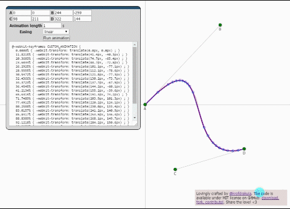

css-animation-bezier
====================

[](https://gitter.im/KrofDrakula/css-animation-bezier?utm_source=badge&utm_medium=badge&utm_campaign=pr-badge&utm_content=badge)

A tool for generating CSS3 Animation using linear approximated Bézier paths.

Try out the generator live in your browser right now!

http://krofdrakula.github.io/css-animation-bezier/

[](http://krofdrakula.github.io/css-animation-bezier/)

Contributions welcome.

Usage
-----

Include `curves[.min].js` on your page (or `require` the file using NodeJS). To create a curve, instantiate a new Bézier curve instance:

```js
var b = new BezierCurve(
    new Vector2d(10, 10),
    new Vector2d(40, 10),
    new Vector2d(10, 40),
    new Vector2d(40, 40)
);
 
var g = new AnimationGenerator;
 
console.log(g.generate(b));
```

This will output the stylesheet content as a string to the console.

Options
-------

You can pass any of the following optional parameters to the `AnimationGenerator` class:

```js
var g = new AnimationGenerator({
    segments: 128,          // the maximum number of segments to generate,
                            // should be adequate for any kind of curve,
                            // but we all remember how well "640k enough
                            // for anybody" worked out, yeah?

    orientAlongPath: false, // useful when you want to rotate the element
                            // along the curve according to the slope (think
                            // animating cars on rails)

    maxError: 1,            // the number of pixels the line segments are
                            // allowed to deviate from the Bézier curve;
                            // the smaller, the better, but anything below
                            // 1 shouldn't make much of a difference

    name: 'MY_ANIMATION'    // what the generated animation name should be
});
```

If you're stuck with a string you don't really know what to do with:

### Vanilla JS

```js
// create the curve
var b = new BezierCurve(
    new Vector2d(10, 10),
    new Vector2d(40, 10),
    new Vector2d(10, 40),
    new Vector2d(40, 40)
);

// create the generator
var g = new AnimationGenerator({
    name: 'MY_ANIMATION'
});

// create the <style> tag and fill it with the stylesheet content
var s = document.createElement('style');
s.textContent = g.generate(b);
// attach it to <head>
document.querySelector('head').appendChild(s);

// you can now use the 'MY_ANIMATION' animation on an element
```

### jQuery

```js
// create the curve
var b = new BezierCurve(
    new Vector2d(10, 10),
    new Vector2d(40, 10),
    new Vector2d(10, 40),
    new Vector2d(40, 40)
);

// create the generator
var g = new AnimationGenerator({
    name: 'MY_ANIMATION'
});

// create the <style> tag and fill it with the stylesheet content
// and attach it to the head
$('<style>').text(g.generate(b)).appendTo('head');

// you can now use the 'MY_ANIMATION' animation on an element
```

Internals
---------

The library uses line segments to approximate the Bézier curve. It implements a very simple and naïve optimization algorithm that eliminates redundant line segments that do not contribute to the curve reproduction fidelity. The curve ends up using more line segments where the curve's slope varies more.

It could be improved further by using more advanced techniques, but it satisfies the need for speed and quality I had for the project I was working on. YMMV. Perhaps someone can enlighten me on a better way to approach this.

Browser Compatibility
---------------------

The library currently generates WebKit-prefixed stylesheet content, but will be upgraded later for runtime determination.
